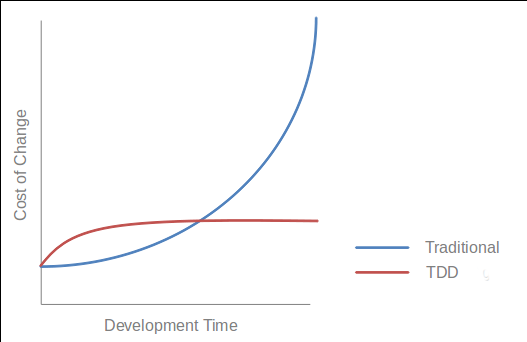

# Behavior Driven Development uses examples in conversations to illustrate behavior

~ Liz Keogh

---

# Learn BDD means learn what BDD does for you

## BDD is not about tools
## BDD is about methodology

#Presenter Notes

BDD is about communication : how features are working, the team are chaning : for now, for one year. BDD is for long term relationships

http://www.slideshare.net/marcello.duarte/pair-programming-tdd-and-other-impractical-things

---

## SpecBDD

Code, functions / methods as specifications

TDD done right

    !php
    use PhpSpec\ObjectBehavior;

    class MarkdownSpec extends ObjectBehavior
    {
        function it_converts_plain_text_to_html_paragraphs()
        {
            $this->toHtml("Hi, there")->shouldReturn("
Hi, there
");
        }
    }

---

## StoryBDD 1/3

### Ubiquitous language

    !gherkin
    Given some initial context (the givens),
    When an event occurs,
    Then some outcome should occur.

* BDD is about having conversations
* BDD should make it easy to create software
* A scenario is an idea, not a promise

---

## StoryBDD 2/3

### Feature files

Use a descriptive title and explain the goal using a short paragraph
Start with basic examples; then expand through exploring

    !gherkin
    Feature: ls
      In order to see the directory structure
      As a UNIX user
      I need to be able to list the current directory's contents

      Scenario: List 2 files in a directory
        Given I am in a directory "test"
        And I have a file named "foo"
        And I have a file named "bar"
        When I run "ls"
        Then I should get:
          """
          bar
          foo
          """
* Plain text, one ore more scenarios for each User Story
* Understanding customers needs

---

## StoryBDD 3/3

### Step definitions

    !php
    /**
     * @Given /^I am in a directory "([^"]*)"$/
     */
    public function iAmInADirectory($dir)
    {
        if (!file_exists($dir)) {
            mkdir($dir);
        }
        chdir($dir);
    }

    /**
     * @Then /^I should get:$/
     */
    public function iShouldGet(PyStringNode $string)
    {
        assertEquals($string->getRaw(), $this->output);
    }

Evolving suite of acceptance tests

---

## Goals

* Implementing something correctly
* Implementing the right thing
* Acceptance tests are secondary to the understanding
* Customer co-produces them

---

## Workflow

* The business owner and the PO have a conversation about what they need.
* Then the PO discuss with testers and developers to elaborate requirements in an English langage format "scenarios"
* The scenarios guide the developer and act as automated tests
* QA use these scenarios as the basis for their tests

---

## What's new ?

* Business requirements baked into development effort
* Specs are elaborated collaboratively
* Common languages
* Executable specifications provide fast feedback

#Presenter Notes
Bye bye les cachiers de specs
// Tests suites aren't only interesting to developers (eg: Project Manager)

---

## Specifications by examples

Examples can help you discover things early

* Explore requirements
* Discover what we don't know
* Clarify ambiguities
* Identify assumptions and misunderstandings
* Living documentation
* Illustrates delivered features
* A starting point for manual tests
* Progress reporting
* Functionnal and technical documentation

---

## Benefits :

* Make changes safely
* Faster and more reliable releases
* Reduced maintenance costs
* Code coverage does not make much sense. If you really do BDD, everything is "covered".

#Presenter Notes

Permettre aux développeurs de continuer à innover
