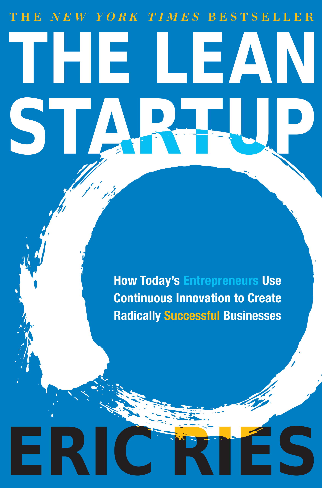
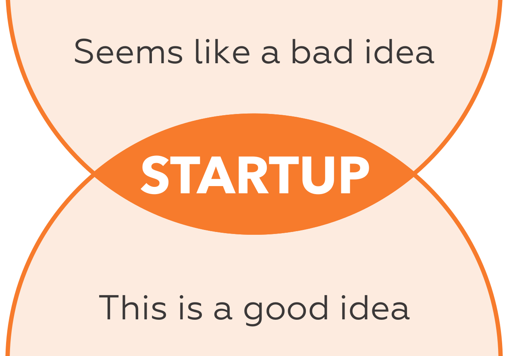
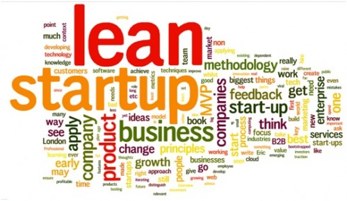
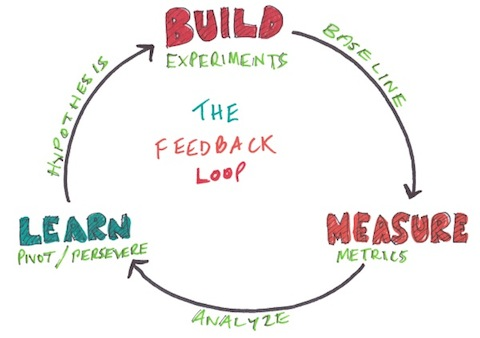
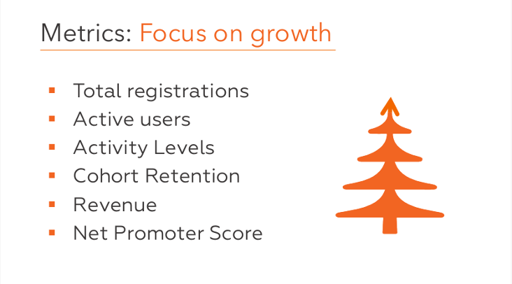
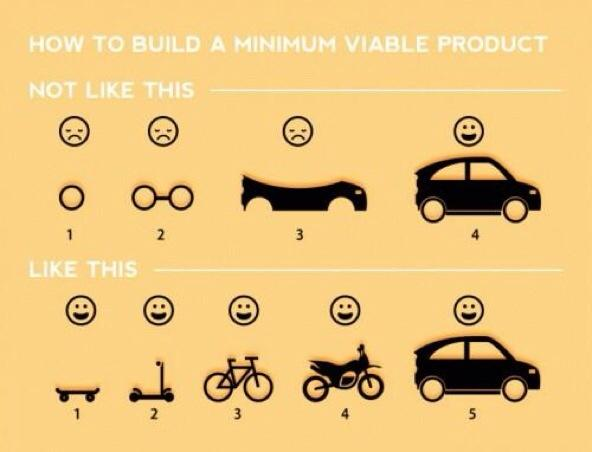

---

# Don't know what a startup is ?

[How to Start a Startup ? - Y Combinator](http://startupclass.samaltman.com/)

[Startupfood - Vidéos en français](https://www.youtube.com/user/Startupfood)

And ...

---

# Read The Fucking Manual(s)

---

# Startup = Experiment

---

---

---

# Find customers

###  Build something users love
###  Talk to users

---

# Build a MVP

## Prioritize features and iterate...

---

# What the Media Thinks It’s Like

---

# What It’s Actually Like

---

## Building the product right and the right product

- Assurance that all stakeholders and delivery team members understand what needs to be delivered in the same way.
- Precise specifications so delivery teals avoir wasteful rework caused by amiguities and functional gaps.
- An objective means to measure when a piece of work is complete.
- Documentation to facilitate change, in terms of both software features and team structure.
- Avoid wasteful over-specifying; avoir spending time on details that will change befoire a piece of work is developed.
- Have a reliable documentatation that explains what the system does so we can change it easily.
- Efficiently check that a system does what the specifications say.
- Keep documentation relevant and reliable with minimal maintenance costs.

---

"The formulation of a problem is often more essential than its solution." - Albert Einstein

