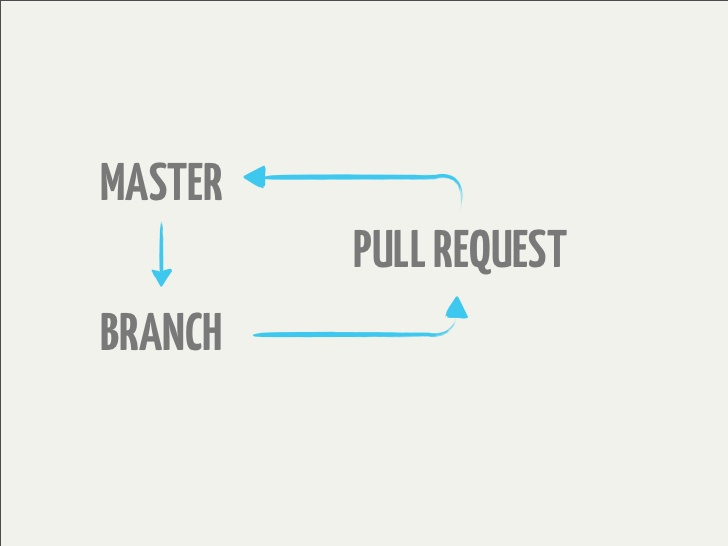
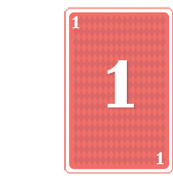
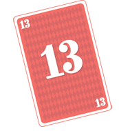
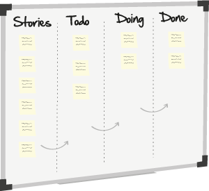
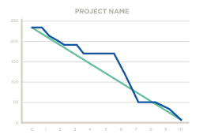

# Step 01 : Requirements (Scrum &  Git workflow)

---

---

# SCRUM

---

# Divide features in User Stories

---

## Estimate complexity and prioritise

---

## Project Managment : Taiga.io, Trello...

---

## Friday : demo day (beers welcome) !

Only what is in Done

---

## Sprint debrief

What was good ? To be improved ?

Then the next Sprint starts...

---

## Open source all the things !

- Free development tools
- Contributors

Licence ?

---

UX design -> Graphic Design -> Développement
