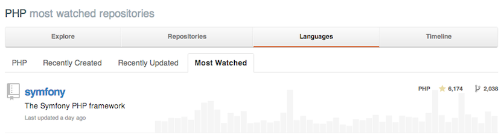

# Step 03 : SOA and modern technologies

---

# If you're handling a huge project or something that is going to scale...

---

# A software design based on discrete software components, "services", that collectively provide the functionalities of the larger software application

---

# To provide your users a chat, PHP might not be the best...

---

# To improve performances, you decide your frontend should have its own in-memory persistance, to be faster...and you put it into another service

---

# SCALE

---

# In human understandable words, SOA is a software design which embraces splitting an architecture into smaller pieces, thus making them independent, loosely coupled and more maintainable.

---

# Ok, but in real world ?

---

# DATA

Each service might have its own data-layer, but nothing prevents you from sharing accross the services.

- Frontend needs fast Redis
- Backend Mysql transactions.

---

# Abstract the data

Don't care how they are stored

---

# REST

---

# Events

- Services notify the architecture that an event has happened
- Don't wait : notify

# Presenter Notes

sign up then send emails

---

# Asynchronous messages queues

RabbitMQ

---

# Use Supervisor to keep daemons alive

---

# Use the proper technology for what it has been done

---

# Abstract the data

Repositories need interfaces
Entities need interfaces

---

# Centralized authentification

# Json Web Token
# Modern apps, modern tech

---

# PHP developers are dead

---

# Long live API engineers !

---

# SOA is complex

---

# Loose coupling

Every service is independent, not forced to the constraints of a monolithic block.

You have the freedom of changing or replacing services without the hassle of touching the entire system.

---

# Fault tolerant

If one is down, the others keep working.

#Presenter Notes

If one of the services has an outage, the rest of the architecture will still works
Is a service, listening for messages is down, the publish doesn't get stuck

---

# Modern technologies

---

# API

- Symfony
- Ruby on Rails
- Node.js
- Python, Go ?

Performance, knowledge, structure, test tools, recruitment, many factors count...

---

JavaScript

# Use ECMAScript 6

[https://github.com/lukehoban/es6features](https://github.com/lukehoban/es6features)

Turn ES6 code into readable vanilla ES5 with source maps.

Code syntax checked by jslint.

[https://github.com/airbnb/javascript](https://github.com/airbnb/javascript)

---

# Angular.Js

Follow a guide :
[https://github.com/gocardless/angularjs-style-guide](https://github.com/gocardless/angularjs-style-guide)

[http://www.airpair.com/angularjs](Learn in 10.000 words)

Templating with jade ?

Maybe consider using React.js for faster loading and Isomorphic JS ?

---

---

# Node.js

## Real time communication

Also use es6 :

[http://www.airpair.com/javascript/posts/using-es6-harmony-with-nodejs](http://www.airpair.com/javascript/posts/using-es6-harmony-with-nodejs)

---

# CSS ?

Use SASS

scsslint
